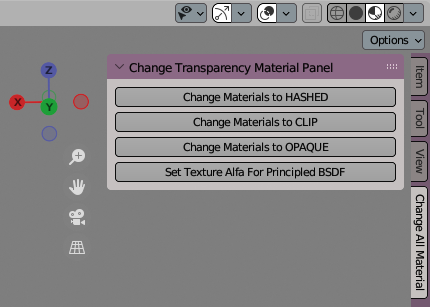

# Blender Transparency Fix Plugin

Um plugin simples para o Blender que corrige a transparência das texturas ao importar arquivos .obj
  Ao importar modelos 3d usando o importado de .obj, percebi que as texturas com transparência ficavam pretas, e para corrigir isso algumas propriedades no material deveriam ser mudadas, esse plugin faz isso em lote para todos os materiais do modelo.
  Nota; os plugins do blender são escritos em python, no qual não domino ainda essa linguagem de programação, então esse plugins é uma adaptação desse código (**[link](https://blender.stackexchange.com/questions/220490/changing-default-blend-mode-settings-for-materials)**), no qual fiz de uma maneira simples para resolver o problema.

Instalação
----------
No menu em "Edit/Preferences..", na aba "Add-ons", clique em "Install..", selecione o aquivo .zip fornecido em "Releases" ao lado direito desse texto.
  Esse plugin terá como nome "JADERLINK Texture Fix", masque a caixa ao lado do nome para ativar o plugin.

Como usar
---------
O menu do plugin se encontra ao lado direito do contêiner "3D ViewPort" conforme imagem abaixo:

Para o plugin funcionar, depois de importar o arquivo .obj para o blender, você deve clicar em um dos botões e depois em "OK";
  segue a baixo a explicação de cada botão:

**Change Materials to HASHED/CLIP/OPAQUE**

Nesses três botões será definido o tipo de transparência da textura, sendo o "OPAQUE" nenhuma transparência.
  Você só precisa usar somente um dos botões.

**Set Texture Alfa For Principled BSDF**

E para as funções de cima funcionarem, também deve ser clicado nesse botão, e ira ligar o canal de "alfa" da textura no canal de "alfa" do shader (ele considera que o shader usado é o "Principled BSDF", que é o criado por padrão ao importar o arquivo .obj)

**At.te: JADERLINK**
 2023-10-02